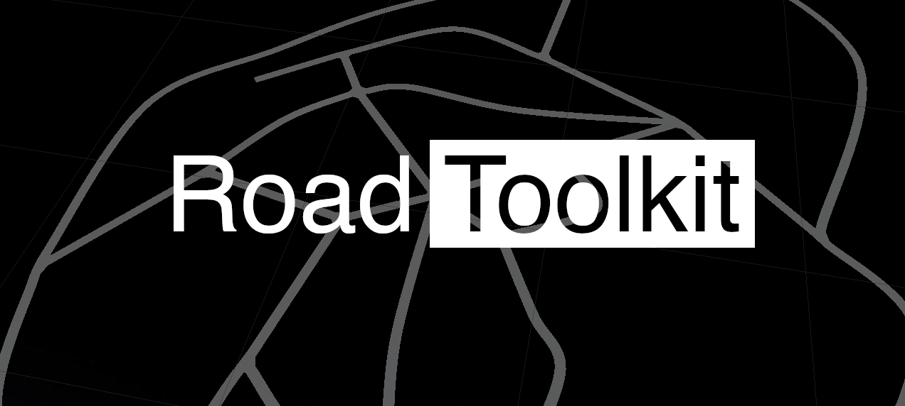

Toolkit for procedural road mesh generation in Unity.

## Installation

RoadToolkit is delivered as a modern UPM package, follow [official Unity documentation](https://docs.unity3d.com/Manual/upm-ui-giturl.html)

## Features
- Road graph
- Procedueral mesh generation
  - Catmul-Rom spline interpolation
  - Procedural intersections
- Editor tools
- Works in editor and runtime
- More to come...

## Editor controls
- `Left mouse button` - Select node
- `Left mouse button` + `Shift` - Select multiple nodes
- `Left mouse button` + `Ctrl` (between two nodes) - Split road adding a new node
- `N` - Adds a new connected node attached to the selected node
- `E` - Creates a road between selected nodes
- `Delete / Command + Backspace` - Deletes selected nodes